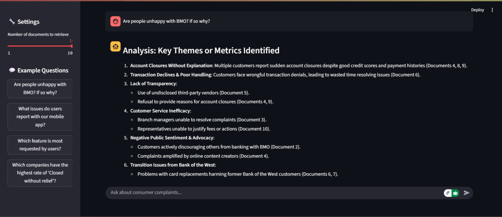

# 📚 Week 6 – RAG Chatbot for Consumer Complaints

Welcome to the **Week 6** repository! This project builds a Retrieval-Augmented Generation (RAG) chatbot that lets you query the CFPB consumer-complaints dataset with an interactive UI. 🚀

---

## 🔍 Overview

We’ve created a Streamlit/Gradio-style interface where you can:

* **Ask** any question about complaints (“What issues do users report with our mobile app?”) 💬
* **Retrieve** the top **N** relevant complaint excerpts via vector similarity 🔎
* **Analyze & Visualize** key themes and metrics in context 📊

Below is a demo of the app in action:

<p align="center">
  
</p>

---

## ✨ Features

* **Configurable Retrieval**
  Adjust the “Number of documents to retrieve” slider (1–10).
* **Example Questions Panel**
  Quickly click common queries to explore insights.
* **Dynamic Analysis**
  Displays top themes, metrics, and supporting document IDs.
* **Clear & Reset**
  A click resets the UI for a fresh query.

---

## 🛠️ Installation

1. **Clone the repo**

   ```bash
   git clone https://github.com/Crackingastro/Week6.git
   cd Week6
   ```
2. **Create a virtual environment**

   ```bash
   python -m venv venv
   source venv/bin/activate   # macOS/Linux
   .\venv\Scripts\activate    # Windows
   ```
3. **Install dependencies**

   ```bash
   pip install -r requirements.txt
   ```
4. **Prepare your data**

   * Place your cleaned `filtered_complaints.csv` in `data/`
   * Update any paths in `app.py` or `streamlit_app.py`

---

## ▶️ Usage

```bash
streamlit run streamlit_app.py
```

* Open your browser at `http://localhost:8501` (Streamlit) or the Gradio link shown in the console.
* Slide the **“Number of documents to retrieve”** bar.
* Type your question or click an example.
* Hit **Ask** and watch the insights appear!

---

## 📂 Repo Structure

```
Week6/
├── app.py               # Gradio-based chat UI
├── streamlit_app.py     # Streamlit alternative UI
├── data/
│   └── filtered_complaints.csv
├── vector_store/        # ChromaDB persistence directory
├── requirements.txt
└── README.md            # ← You are here!
```

---

## 🤝 Contributing

1. Fork this repository
2. Create a feature branch (`git checkout -b feature/my-change`)
3. Commit your changes (`git commit -m "Add awesome feature"`)
4. Push to your branch (`git push origin feature/my-change`)
5. Open a Pull Request

---


